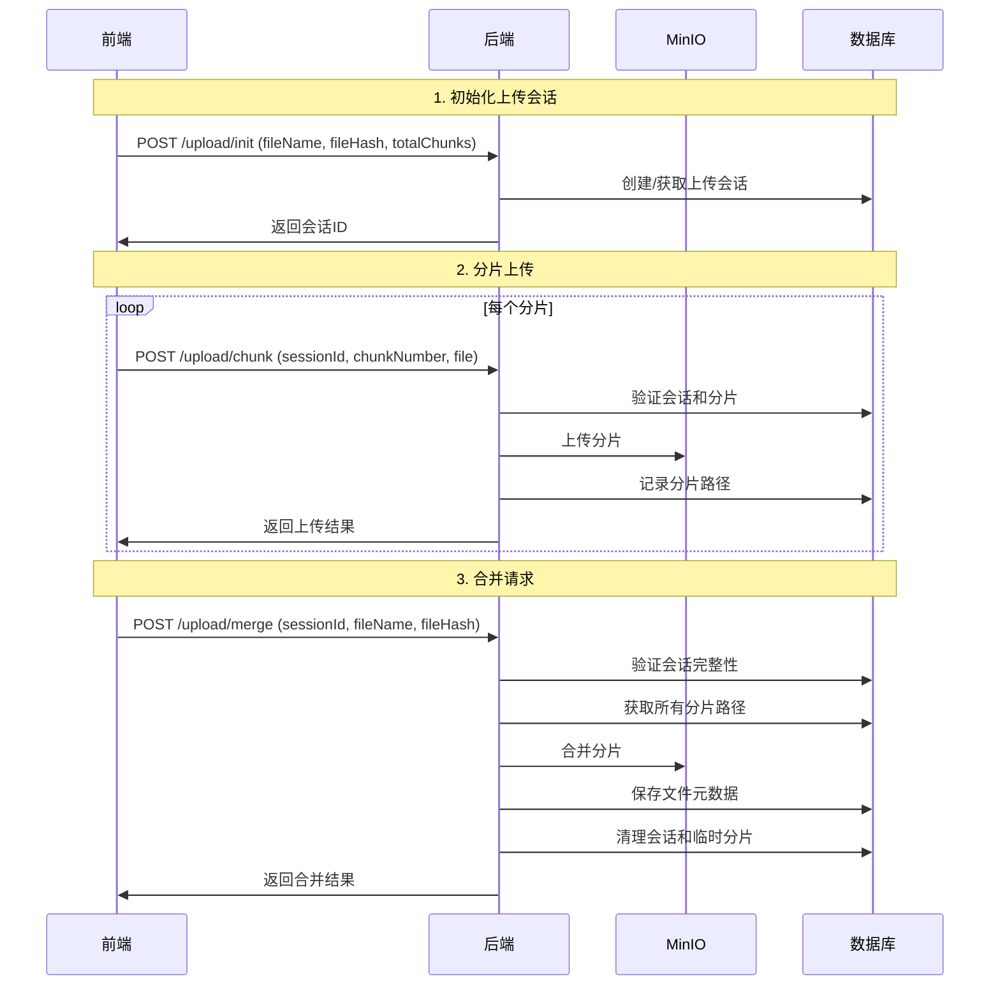

# 改进的分片上传架构

## 问题分析

当前架构中，前端在合并时传入所有分片路径存在以下问题：

### 1. 安全性问题
- 前端可以任意指定分片路径，存在安全漏洞
- 恶意用户可能传入不属于自己的分片路径
- 缺乏对分片完整性的验证

### 2. 数据一致性问题
- 前端可能传入错误或不完整的分片路径
- 无法保证分片的顺序和完整性
- 如果前端数据丢失，无法恢复分片信息

### 3. 架构设计问题
- 后端过度依赖前端提供的数据
- 违反了"不信任客户端"的安全原则

## 改进方案

### 方案一：后端维护分片状态（推荐）

#### 核心思想
- 后端维护每个上传会话的完整状态
- 前端只需要提供会话ID和基本验证信息
- 后端负责分片路径的管理和验证

#### 改进后的流程



#### 主要改进点

1. **会话管理**
   - 后端维护 `ChunkUploadSession` 表
   - 记录每个会话的状态和已上传分片信息
   - 支持会话过期和清理机制

2. **安全验证**
   - 分片上传时验证会话归属
   - 合并时验证分片完整性
   - 防止恶意用户访问他人的分片

3. **数据一致性**
   - 后端确保分片的顺序和完整性
   - 支持断点续传时的状态恢复
   - 原子性的合并操作

#### 新增的API接口

```java
// 1. 初始化上传会话
POST /upload/init
{
    "fileName": "example.pdf",
    "fileHash": "abc123...",
    "fileSize": 10485760,
    "contentType": "application/pdf",
    "totalChunks": 3,
    "folderPath": "documents"
}

// 2. 上传分片（修改）
POST /upload/chunk
FormData:
- sessionId: "abc123..."
- chunkNumber: 1
- file: [binary data]

// 3. 获取上传状态
GET /upload/status/{sessionId}

// 4. 合并分片（简化）
POST /upload/merge
{
    "sessionId": "abc123...",
    "fileName": "example.pdf",
    "fileHash": "abc123...",
    "expectedChunkCount": 3
}
```

#### 数据库表结构

```sql
CREATE TABLE chunk_upload_sessions (
    id BIGINT PRIMARY KEY AUTO_INCREMENT,
    session_id VARCHAR(64) NOT NULL UNIQUE,
    file_name VARCHAR(255) NOT NULL,
    file_hash VARCHAR(64) NOT NULL,
    file_size BIGINT NOT NULL,
    content_type VARCHAR(100),
    folder_path VARCHAR(500),
    total_chunks INT NOT NULL,
    uploaded_chunks INT DEFAULT 0,
    chunk_paths_json TEXT,
    bucket_name VARCHAR(63) NOT NULL,
    storage_type VARCHAR(16) NOT NULL,
    status VARCHAR(20) NOT NULL,
    expires_at TIMESTAMP NOT NULL,
    user_id BIGINT,
    created_at TIMESTAMP DEFAULT CURRENT_TIMESTAMP,
    updated_at TIMESTAMP DEFAULT CURRENT_TIMESTAMP ON UPDATE CURRENT_TIMESTAMP,
    INDEX idx_session_id (session_id),
    INDEX idx_status (status),
    INDEX idx_expires_at (expires_at)
);
```

### 方案二：混合验证模式

如果不想大幅修改现有架构，可以采用混合验证模式：

1. **保留前端传入分片路径**
2. **后端进行严格验证**
   - 验证分片路径格式
   - 验证分片归属权
   - 验证分片完整性
   - 验证分片顺序

```java
// 改进的合并验证逻辑
public void validateChunkPaths(String batchId, List<String> chunkPaths) {
    // 1. 验证路径格式
    for (String path : chunkPaths) {
        if (!path.startsWith(batchId + "/")) {
            throw new SecurityException("Invalid chunk path: " + path);
        }
    }
    
    // 2. 验证分片存在性
    for (String path : chunkPaths) {
        if (!objectStorageService.exists(bucketName, path)) {
            throw new BusinessException("Chunk not found: " + path);
        }
    }
    
    // 3. 验证分片完整性
    if (chunkPaths.size() != expectedChunkCount) {
        throw new BusinessException("Incomplete chunks");
    }
    
    // 4. 验证分片顺序
    validateChunkOrder(chunkPaths);
}
```

## 推荐实施步骤

1. **第一阶段**：实施混合验证模式，增强现有架构的安全性
2. **第二阶段**：逐步迁移到后端维护状态的模式
3. **第三阶段**：完全移除前端分片路径传递，实现完全的后端控制

## 总结

建议采用**方案一（后端维护分片状态）**，因为它：

- ✅ 提供了更好的安全性
- ✅ 确保了数据一致性
- ✅ 符合"不信任客户端"的安全原则
- ✅ 支持更复杂的上传场景（如多用户、权限控制等）
- ✅ 便于实现高级功能（如上传进度恢复、分片去重等）

虽然需要一些架构调整，但长期来看会让系统更加健壮和安全。