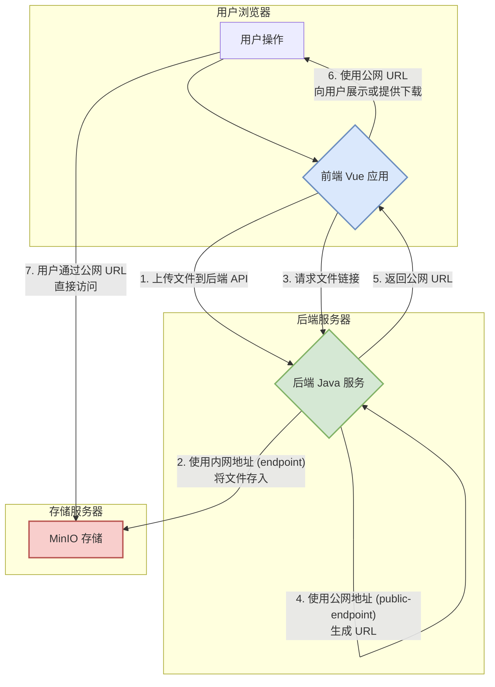

# MinIO 大文件上传与管理平台 - 详细技术文档

## 1. 项目概述

`miniodemo` 是一个功能完备的、基于 Spring Boot 和 Vue.js 的前后端分离文件管理平台。它深度集成了 MinIO 对象存储，旨在提供一个高性能、高可靠性的大文件上传解决方案。项目不仅实现了基本的文件操作，还包含了分片上传、秒传、断点续传、预签名URL等高级功能，是一个学习和实践MinIO最佳实践的优秀范例。

## 2. 核心特性

- **分片上传**: 支持将超大文件分割成小块独立上传，并在后端合并，提高了大文件上传的稳定性和可靠性。
- **内外网分离架构**: 后端与MinIO通过内网地址通信，保证速度与安全；所有返回给前端的访问链接都基于公网地址生成，保证了终端用户的可访问性。
- **内容寻址存储 (Content-Addressable Storage)**: 系统不使用原始文件名作为存储对象的唯一标识，而是使用文件内容的MD5哈希值。这意味着，**任何内容相同的文件，在后端只会被存储一份**，从根本上实现了数据去重，极大地节省了存储空间。
- **秒传**: 基于内容寻址存储，当用户上传一个文件时，系统会先计算其哈希值。如果发现服务器上已存在具有相同哈希值的对象，则会跳过实际的上传过程，直接完成操作，实现"秒传"。
- **后台自动清理**: 每日定时任务，自动清理因各种原因（如网络中断、用户关闭页面）产生的临时分片文件，保持存储整洁。

## 3. 技术栈

- **后端**:
    - `Spring Boot`: 核心框架
    - `MinIO Java SDK`: 与MinIO服务器交互
    - `Lombok`: 简化Java代码
- **前端**:
    - `Vue.js 3`: 组合式API
    - `Vite`: 新一代前端构建工具
    - `Element Plus`: UI组件库
    - `Axios`: HTTP请求库
    - `SparkMD5`: 前端大文件哈希计算
- **存储**:
    - `MinIO`: 高性能、S3兼容的对象存储服务

## 4. 系统架构

项目实现了一套精巧的双端点架构，兼顾了内网通信的**性能与安全**，以及外网访问的**便利性**。



- **内网端点 (endpoint)**: 仅用于后端Java服务与MinIO服务器之间的通信（如上传、删除、合并分片等）。
- **公网端点 (public-endpoint)**: 专门用于生成最终给用户访问的URL。

## 5. 核心实现原理：秒传与内容寻址

本项目的秒传功能并非基于简单的文件名判断，而是基于健壮的"内容寻址"思想。

### 为什么对文件内容哈希？
- **唯一性**: 只有文件内容完全相同时，它们的哈希值才会相同。这保证了我们能准确识别出重复的数据。
- **与文件名解耦**: 不同用户可能用不同的名字上传相同内容的文件（如 `report.docx` 和 `总结.docx`），或用相同的名字上传不同内容的文件。基于内容哈希可以准确处理这些情况。

### 核心流程
1.  **前端计算哈希**: 当用户选择一个文件，浏览器端的 `spark-md5` 库会在上传开始前，读取文件的二进制内容，并计算出其MD5哈希值。
2.  **后端预检查**: 前端将计算出的 `fileHash` 和原始 `fileName` 发送到后端的 `/check` 接口。
3.  **后端决策**:
    -   **存在**: 后端根据 `年/月/日/哈希/文件名` 的规则构造对象路径，在MinIO中查询。如果找到了，说明文件已存在，立即向前端返回 `{"exists": true}`，前端终止上传，提示"秒传成功"。
    -   **不存在**: 如果MinIO中没有该对象，后端返回 `{"exists": false}`，前端开始执行标准的文件上传流程。
4.  **结构化路径存储**: 当一个新文件被上传并（或分片并）合并后，后端在MinIO中存储该文件时，会使用 **`年/月/日/文件哈希/原始文件名`** 的结构作为最终的**对象名 (Object Name)**。这种方式既包含了哈希作为唯一标识，又保留了原始文件名，便于管理和追溯。
5.  **列表展示**: 当用户请求文件列表时，后端会遍历存储桶，从每个对象的完整路径中解析出原始文件名，返回给前端进行展示。这样，用户看到的始终是自己熟悉的文件名，而非一长串无意义的哈希值。

## 6. 性能说明：为什么首次上传变慢了？

在引入秒传功能后，您可能会注意到，上传一个**全新的、服务器上不存在的文件**时，上传开始前会有一个短暂的"计算中"或"准备中"的阶段。这是**正常且符合预期的现象**。

这个"延迟"来源于**第1步：前端计算哈希**。浏览器需要花费一定的时间（取决于文件大小和您电脑的性能）来完整读取文件内容并计算其哈希值。

这是一个必要的技术权衡：我们用首次上传一个新文件时增加的这一点计算时间，换取了未来任何时候再次上传该文件（或其任何副本）时，都能享受到**几乎零耗时**的"秒传"体验，并从根本上节省了服务器的存储空间。

## 7. 部署与运行指南

### 7.1. 环境准备
- `Java` (JDK 17 或更高版本)
- `Maven`
- `Node.js` (LTS版本)
- `Docker` (推荐，用于运行MinIO)

### 7.2. MinIO 服务器配置
1.  **运行MinIO (推荐使用Docker)**:
    ```bash
    docker run -p 9000:9000 -p 9001:9001 --name minio \
      -e "MINIO_ROOT_USER=YOUR_ACCESS_KEY" \
      -e "MINIO_ROOT_PASSWORD=YOUR_SECRET_KEY" \
      -v /path/to/your/minio/data:/data \
      quay.io/minio/minio server /data --console-address ":9001"
    ```
2.  **创建存储桶**:
    - 通过浏览器访问 MinIO 控制台 (例如 `http://localhost:9001`)。
    - 创建两个存储桶：`private-files` 和 `public-assets`。
3.  **设置公共桶策略 (关键!)**:
    - 选中 `public-assets` 存储桶，进入"管理" -> "访问策略"。
    - 将访问策略从"私有" (private) 修改为"**公开**" (public)。否则所有公共文件的直链都将无法访问。

### 7.3. 后端服务配置与启动
1.  **修改配置文件**: 打开 `src/main/resources/application-prod.yml` (或 `application-dev.yml`)，根据您的环境填写所有MinIO相关配置：
    ```yaml
    minio:
      # MinIO的内网访问地址，供后端服务连接使用
      endpoint: http://localhost:9000 
      # MinIO的公网访问地址，用于生成分享链接 (可以是域名或公网IP)
      public-endpoint: http://your-public-domain.com
      # 您的MinIO Access Key
      access-key: YOUR_ACCESS_KEY
      # 您的MinIO Secret Key
      secret-key: YOUR_SECRET_KEY
    ```
2.  **启动后端服务**:
    ```bash
    # 在项目根目录下执行
    mvn spring-boot:run
    ```

### 7.4. 前端项目配置与启动
1.  **安装依赖**:
    ```bash
    cd miniovue3
    npm install
    ```
2.  **启动开发服务器**:
    ```bash
    npm run dev
    ```
3.  现在，您可以通过浏览器访问前端页面 (通常是 `http://localhost:5173`) 来使用整个系统了。

## 8. 后端 API 接口文档

API基础路径: `/minio` (通过前端代理 `/api/minio` 访问)

### 8.1. 公共资源接口 (`/public`)
| 方法   | URL             | 描述                 | 参数                                                               | 成功响应                                |
| :---   | :---            | :---                 | :---                                                               | :---                                    |
| `GET`  | `/list`         | 获取所有公共文件列表 | 无                                                                 | `200 OK` <br> `List<FileDetailDto>`     |
| `POST` | `/check`        | 检查文件是否存在（秒传） | **Body** (JSON):<br>`{ "fileHash": "...", "fileName": "..." }`       | `200 OK` <br> `FileExistsDto`           |
| `POST` | `/upload`       | 上传单个公共文件     | **FormData**:<br>- `file`: 文件本身<br>- `fileHash`: 文件MD5         | `200 OK` <br> `String` (文件的公网URL)    |
| `DELETE`| `/delete`      | 删除一个公共文件     | **Query**: `fileName` (文件的完整对象路径)                         | `200 OK` <br> `String` (成功信息)       |

### 8.2. 私有文件接口 (`/private`)
| 方法   | URL                  | 描述                         | 参数                                                                     | 成功响应                                |
| :---   | :---                 | :---                         | :---                                                                     | :---                                    |
| `GET`  | `/list`              | 获取所有私有文件列表         | 无                                                                       | `200 OK` <br> `List<FileDetailDto>`     |
| `POST` | `/check`             | 检查文件是否存在（秒传）     | **Body** (JSON):<br>`{ "fileHash": "...", "fileName": "..." }`             | `200 OK` <br> `FileExistsDto`           |
| `POST` | `/upload/chunk`      | 上传单个文件分片             | **FormData**:<br>- `file`: 文件分片<br>- `batchId`: 本次上传的唯一ID<br>- `chunkNumber`: 分片序号 | `200 OK` <br> `String` (成功信息)       |
| `POST` | `/upload/merge`      | 通知服务器合并分片           | **Body** (JSON):<br>`{ "batchId": "...", "fileName": "...", "fileHash": "..." }` | `200 OK` <br> `String` (成功信息)       |
| `GET`  | `/download-url`      | 获取私有文件的预签名下载URL  | **Query**: `fileName` (文件的完整对象路径)                               | `200 OK` <br> `String` (15分钟有效的URL) |
| `DELETE`| `/delete`           | 删除一个私有文件             | **Query**: `fileName` (文件的完整对象路径)                               | `200 OK` <br> `String` (成功信息)       |

### 8.3. 存储桶接口 (`/buckets`)
| 方法   | URL          | 描述                         | 参数 | 成功响应                            |
| :---   | :---         | :---                         | :--- | :---                                |
| `POST` | `/init`      | 初始化项目所需的两个存储桶   | 无   | `200 OK` <br> `String` (成功信息)    |